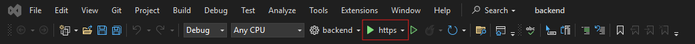
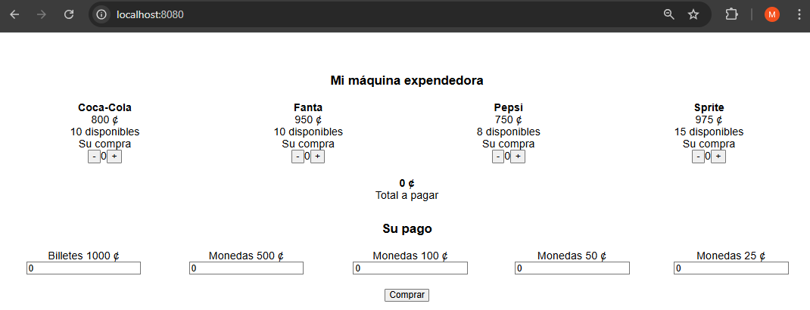

# ExamenIS
En este repositorio se encuentra la solución a la segunda parte del examen de Ingeniería de Software.

# Instrucciones para la ejecución

1. Ejecutar el backend

En la carpeta <b>ExamenIS</b> debe dirigirse a la carpeta backend y ejecutar backend.sln para abrir el proyecto de VisualStudio.



Con ejecutar este paso el backend de la aplicación ya estaría corriendo correctamente.

2. Ejecutar el frontend

Desde la terminal <b>Windows CMD</b> dirijase a la carpeta <b>Frontend</b> dentro de la carpeta <b>ExamenIS</b>

Debe colocarse en esta carpeta:

```C:\Users\MAINOR\Desktop\ExamenIS\frontend>```

Aquí deberá ejecutar el comando:

```npm install```

Y luego el comando

```npm run serve```

Si todo sale de manera correcta deberá ver algo similar a lo siguiente:

```bash
 DONE  Compiled successfully in 2803ms

 App running at:
  - Local:   http://localhost:8080/
  - Network: http://192.168.100.9:8080/

 Note that the development build is not optimized.
 To create a production build, run npm run build.
```

3. Usar aplicación

Para usar la aplicación deberá dirigirse en su buscador a la dirección

[http://localhost:8080/](http://localhost:8080/)

Si todo sale bien deberá ver algo similar a esto en su buscador de preferencia:

